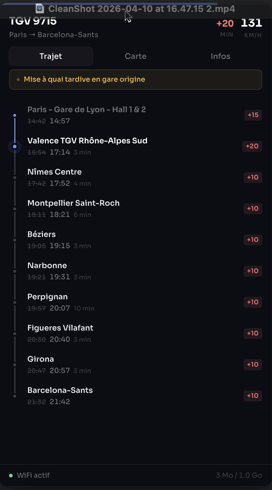
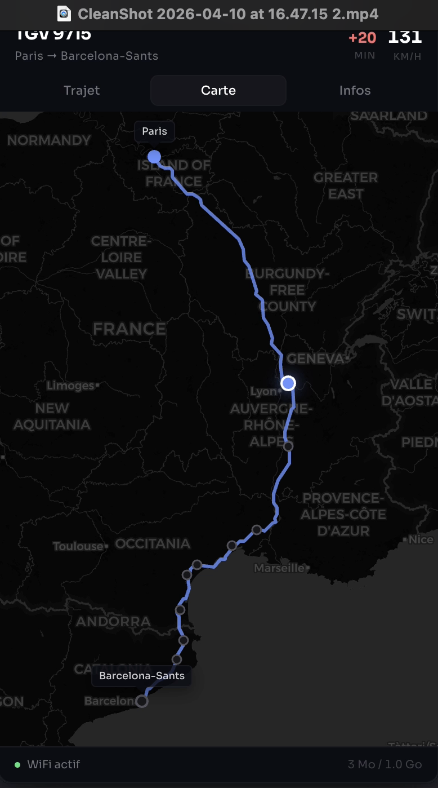
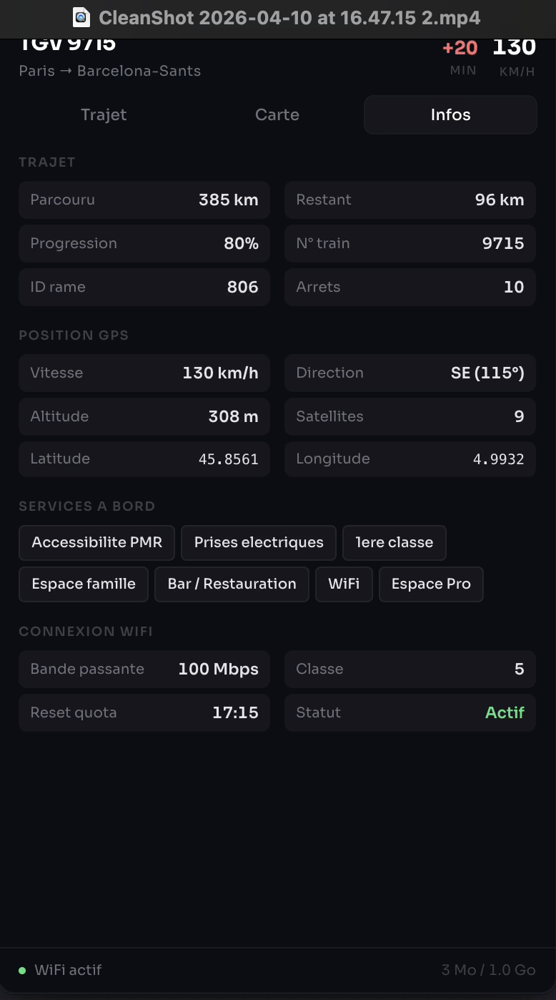

# WifiSncf

Application macOS menu bar qui affiche les informations de votre train SNCF en temps reel, directement depuis le WiFi embarque.

## Screenshots

| Trajet | Carte | Infos |
|:---:|:---:|:---:|
|  |  |  |

## Fonctionnalites

### Onglet Trajet
- **Vitesse en temps reel** du train (GPS, conversion m/s → km/h)
- **Retards** avec raison et horaires theoriques barres
- **Timeline des arrets** avec indicateur de progression (passe / en cours / a venir)
- **Barre de progression** du trajet (% reel depuis l'API)
- **Alertes** en cas de perturbation

### Onglet Carte
- **Carte interactive** (Leaflet + CartoDB Dark) avec le trace GeoJSON complet
- **Position du train** en temps reel sur la carte
- **Marqueurs des gares** avec tooltip au survol
- **Noms des terminus** affiches en permanence

### Onglet Infos
- **Distances** : parcourue, restante, progression en %
- **Position GPS** : altitude, direction (boussole), coordonnees, nombre de satellites
- **Services a bord** : bar, WiFi, prises electriques, espace famille, etc.
- **Details WiFi** : bande passante, classe de service, reset du quota

### General
- **Widget flottant** qui apparait au survol de la zone sous le notch
- **Statut WiFi** en pied de page avec consommation data
- **Rafraichissement automatique** toutes les 15 secondes

## APIs utilisees

L'application interroge les APIs du portail `wifi.sncf` (accessibles uniquement depuis le WiFi du train) :

| Endpoint | Description |
|---|---|
| `/router/api/train/details` | Numero du train, arrets, horaires, retards, services, progression |
| `/router/api/train/gps` | Position GPS, vitesse, cap, altitude, satellites |
| `/router/api/train/graph` | Trace GeoJSON complet du trajet |
| `/router/api/connection/status` | Statut WiFi, bande passante, quota data |

## Stack technique

- **Electron** + **Electron Forge**
- **TypeScript**
- **React**
- **Vite**
- **Leaflet** (carte CartoDB Dark)
- **Axios** (requetes HTTP)

## Installation

```bash
npm install
```

## Developpement

```bash
npm start
```

Lance l'application en mode developpement avec hot reload.

## Build

```bash
npm run package
```

Genere l'application packagée dans le dossier `out/`.

```bash
npm run make
```

Genere les installateurs (DMG, ZIP) dans `out/make/`.

## Licence

MIT - Yoan Bernabeu 2026
